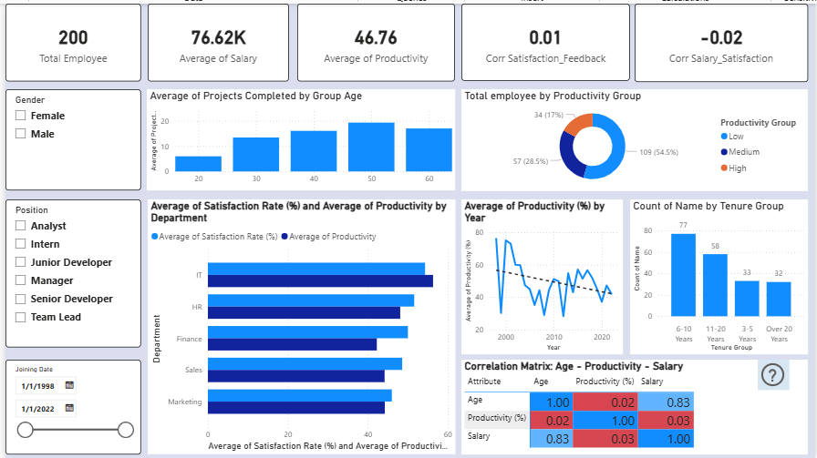

# HR Analytics: Employee Productivity & Satisfaction Analysis

## 📌 Project Overview
This repository contains an end-to-end HR Analytics project designed to investigate the relationship between employee productivity, job satisfaction, and underlying corporate factors (such as Age, Department, Salary, and Tenure). 

As an HR Data Analyst, the ultimate objective is to extract actionable insights regarding workforce performance, diagnose systemic organizational issues, and propose strategic, data-backed recommendations to management.

---

---

## 📊 Dataset Overview
The analysis is conducted on a dataset containing unique profiles of **200 employees** with an equal gender split (**100 Male / 100 Female**). 

The workforce distribution across organizational departments is structured as follows:
* **Sales:** 47 employees
* **Marketing:** 42 employees
* **Finance:** 41 employees
* **IT:** 38 employees
* **HR:** 32 employees

---
🖼️ Dashboard Preview & Interactive Features
*The dashboard features advanced dynamic filtering, cross-highlighting, and interactive drill-down paths from country-level trends to granular customer details.*



---

## 🛠️ Tech Stack & Workflow

### 1. Data Preparation & ETL (Python - Jupyter Notebook)
* **Data Import:** Extracted raw personnel records from `hr_dashboard_data.csv`.
* **Data Cleansing:** Parsed string values in *Joining Date* into standard datetime objects.
  * Handled missing records inside the *Salary* column using logical imputation.
  * Dropped duplicate rows based on employee *Name* to preserve unique statistical observation units.
* **Feature Engineering:** Computed *Experience Years* dynamically: `Current Year - Joining Year`.
  * Mapped individual performance metrics into a categorical *Productivity Group* via custom logic: 
    * **Low:** Under 50%
    * **Medium:** 50% - 80%
    * **High:** Over 80%
👉 To view the complete step-by-step data preprocessing and feature engineering code, please check out the source file here: [Jupyter Notebook Link](notebook/HR_cleaned.ipynb)
### 2. Advanced Transformation (Power BI - Power Query)
**Lifecycle Binning:** Deployed conditional logical structures in Power Query to group continuous tenure metrics into a refined, granular *Tenure Group* to isolate workforce behaviors across milestones:

| Tenure Milestone | Employee Classification |
| :--- | :--- |
| **1-2 Years** | Fresh New Hires |
| **3-5 Years** | Mid-Tenure Dip |
| **6-10 Years** | Established |
| **11-20 Years** | Mid-Career |
| **Over 20 Years** | Veterans |

---

## 🔢 Data Modeling & Advanced DAX Expressions
To uncover accurate statistical dependencies instead of relying on visual estimation, advanced **Pearson Correlation Coefficient (r)** measures were formulated in DAX to feed the analytical charts and the Correlation Matrix Heatmap.

> Salary vs. Workplace Satisfaction Correlation:
```
CorrelationScore_Salary_Satis = 
VAR MeanSalary = AVERAGE('cleaned_hr_data'[Salary])
VAR MeanSatis = AVERAGE('cleaned_hr_data'[Satisfaction Rate (%)])
VAR TuSo = SUMX('cleaned_hr_data', ('cleaned_hr_data'[Salary] - MeanSalary) * ('cleaned_hr_data'[Satisfaction Rate (%)] - MeanSatis))
VAR MauSo = SQRT(SUMX('cleaned_hr_data', POWER('cleaned_hr_data'[Salary] - MeanSalary, 2)) * SUMX('cleaned_hr_data', POWER('cleaned_hr_data'[Satisfaction Rate (%)] - MeanSatis, 2)))
RETURN DIVIDE(TuSo, MauSo)
```
> Workplace Satisfaction vs. Performance Feedback Correlation:
```
CorrelationScore_SatisFb = 
VAR MeanSatisfaction = AVERAGE('cleaned_hr_data'[Satisfaction Rate (%)])
VAR MeanFeedback = AVERAGE('cleaned_hr_data'[Feedback Score])
VAR TuSo = SUMX('cleaned_hr_data', ('cleaned_hr_data'[Satisfaction Rate (%)] - MeanSatisfaction) * ('cleaned_hr_data'[Feedback Score] - MeanFeedback))
VAR MauSo = SQRT(SUMX('cleaned_hr_data', POWER('cleaned_hr_data'[Satisfaction Rate (%)] - MeanSatisfaction, 2)) * SUMX('cleaned_hr_data', POWER('cleaned_hr_data'[Feedback Score] - MeanFeedback, 2)))
RETURN DIVIDE(TuSo, MauSo)
```
> Productivity vs. Salary Correlation:
```
Corr Prod-Salary = 
VAR MeanProd = AVERAGE('cleaned_hr_data'[Productivity (%)])
VAR MeanSalary = AVERAGE('cleaned_hr_data'[Salary])
VAR TuSo = SUMX('cleaned_hr_data', ('cleaned_hr_data'[Productivity (%)] - MeanProd) * ('cleaned_hr_data'[Salary] - MeanSalary))
VAR MauSo = SQRT(SUMX('cleaned_hr_data', POWER('cleaned_hr_data'[Productivity (%)] - MeanProd, 2)) * SUMX('cleaned_hr_data', POWER('cleaned_hr_data'[Salary] - MeanSalary, 2)))
RETURN DIVIDE(TuSo, MauSo)
```
> Age vs. Salary Correlation:
```
Corr Age-Salary = 
VAR MeanAge = AVERAGE('cleaned_hr_data'[Age])
VAR MeanSalary = AVERAGE('cleaned_hr_data'[Salary])
VAR TuSo = SUMX('cleaned_hr_data', ('cleaned_hr_data'[Age] - MeanAge) * ('cleaned_hr_data'[Salary] - MeanSalary))
VAR MauSo = SQRT(SUMX('cleaned_hr_data', POWER('cleaned_hr_data'[Age] - MeanAge, 2)) * SUMX('cleaned_hr_data', POWER('cleaned_hr_data'[Salary] - MeanSalary, 2)))
RETURN DIVIDE(TuSo, MauSo)
```
> Dynamic Matrix Heatmap Engine:
```
Heatmap_Values = 
VAR RowAttr = SELECTEDVALUE('Heatmap_Rows'[Attribute])
VAR ColAttr = SELECTEDVALUE('Heatmap_Columns'[Attribute])
RETURN
SWITCH( TRUE(),
    RowAttr = ColAttr, 1,
    (RowAttr = "Age" && ColAttr = "Productivity (%)") || (RowAttr = "Productivity (%)" && ColAttr = "Age"), [Corr Age-Prod],
    (RowAttr = "Age" && ColAttr = "Salary") || (RowAttr = "Salary" && ColAttr = "Age"), [Corr Age-Salary],
    (RowAttr = "Productivity (%)" && ColAttr = "Salary") || (RowAttr = "Salary" && ColAttr = "Productivity (%)"), [Corr Prod-Salary],
    BLANK()
)
```
## 🔍 Key Insights & Findings

### 1. Seniority-Based Compensation (Heatmap Analysis)
* **Finding:** Data shows a strong positive correlation between *Age* and *Salary* ($r = 0.8345$). However, there is no statistical correlation between *Productivity* and *Salary* ($r = 0.0255$) or *Age* and *Productivity* ($r = 0.0212$).
* **Business Takeaway:** Compensation is heavily driven by employee seniority rather than actual output. High earners are not necessarily outperforming lower earners. The current pay structure does not function as an active incentive for higher productivity.
> **💡 Recommendation:** Introduce a performance-based variable bonus system to reward actual output alongside tenure.

### 2. Departmental Gaps (Bar Chart Analysis)
* **Finding:** **IT** records the highest average *Productivity* (56.34%) and workplace *Satisfaction* (54.34%). **Finance** logs the lowest average *Productivity* (42.27%), while **Marketing** scores the lowest in workplace *Satisfaction* (46.02%).
* **Business Takeaway:** IT workflows are well-optimized. The low productivity in Finance indicates manual processing bottlenecks, while Marketing faces low employee engagement due to high target pressures or lack of flexibility.
> **💡 Recommendation:** Automate repetitive manual workflows in Finance. Conduct a separate, targeted engagement check in Marketing to address burnout risks.

### 3. Historical Onboarding Inconsistency (Line Chart Analysis)
* **Finding:** Productivity trends by *Joining Date* show highly unstable, cyclical wave patterns. Hires from 1998 maintain peak averages (76.0%), while intermediate years show sharp drops (e.g., Year 2008 at 29.0% and Year 2012 at 28.3%).
* **Business Takeaway:** Training and knowledge transfer efficiency have been historically inconsistent. Employees hired during corporate restructure phases (like 2008 and 2012) suffered from a lack of proper guidance, whereas legacy staff retain solid institutional knowledge.
> **💡 Recommendation:** Standardize onboarding playbooks and centralize internal training documentation to ensure consistent performance ramp-ups for all hiring years.

### 4. Workforce Distribution (Cross-Filtering Drill-down)
* **Finding:** Interactive cross-filtering reveals that:
  * The **"High"** performance tier (Over 80%) is driven mostly by *Marketing* and *Sales*.
  * The **"Medium"** tier (50% - 80%) is anchored by *IT*.
  * The **"Low"** tier (Under 50%) is distributed relatively evenly across all departments (with *Finance* leading slightly).
* **Business Takeaway:** High-pressure, target-driven environments in Marketing/Sales push top talents to maximize output. IT works within clear, structured boundaries that keep them consistently in the middle. Because underperformance (Low) is distributed evenly company-wide, it points to a systemic gap in recruitment filters or universal onboarding quality rather than isolated leadership issues.
> **💡 Recommendation:** Set up company-wide recruitment screening adjustments and uniform onboarding filters to support underperforming staff globally.

### 5. Satisfaction vs. Feedback Score Disconnect
* **Finding:** The correlation between *Satisfaction Rate* and *Feedback Score* is flat ($r = 0.0081$), while the correlation between *Salary* and *Satisfaction Rate* is slightly negative ($r = -0.0183$).
* **Business Takeaway:** Higher pay does not correlate with employee satisfaction in this company. Furthermore, managers' qualitative evaluations are completely disconnected from how employees actually feel. Top performers receiving good feedback may still be highly unsatisfied, creating a severe retention risk.
> **💡 Recommendation:** Implement regular anonymous satisfaction surveys and train managers to align performance expectations with employee well-being parameter tracking.
---
### 🔍 Interactive Cross-Filtering Insights (Workforce Segmentation)

When interacting with the "Productivity Group" visual, the data reveals critical organizational patterns via cross-filtering:

1. **The "High" Performance Tier (>80%): Led by Marketing and Sales**
   * **Insight:** Top-tier productivity is heavily driven by front-line business units (Marketing & Sales). This indicates that high-pressure, target-driven environments successfully push adaptive talents to maximize their output.
   * **Action:** Replicate the success formulas and incentive models of these top performers across other departments.

2. **The "Medium" Performance Tier (50%-80%): Anchored by IT**
   * **Insight:** The IT department represents the largest share of steady, reliable performers. Due to structured workflows and technical compliance, IT personnel rarely fall into the low bracket but remain consolidated in the medium tier.
   * **Action:** Introduce technical innovation rewards or leadership tracks to motivate these consistent performers to transition into the "High" tier.

3. **The "Low" Performance Tier (<50%): Systemic Distribution (Finance & Sales slightly leading)**
   * **Insight:** Low-productivity metrics are distributed relatively evenly across all departments with minimal variance. This proves that underperformance is NOT a department-specific issue, but rather a systemic gap in the company's hiring filter or onboarding quality.
   * **Action:** Revamp the company-wide onboarding process and establish universal training playbooks to support struggling staff across all functions.
---

## 📂 Repository Structure
```text
├── data/
│   ├── hr_dashboard_data.csv       # Raw personnel records (uncleaned data)
│   └── cleaned_hr_data.csv         # Cleaned and processed dataset ready for BI modeling
├── notebook/
│   └── HR_cleaned.ipynb            # Jupyter Notebook containing Python ETL & cleaning scripts
├── powerBI/
│   └── HR.pbix                     # Core Power BI Desktop project file with data model
├── dashboard/
│   └── dashboard.png               # High-resolution screenshot of the final reporting dashboard
└── README.md                       # Comprehensive project documentation and insight delivery
```
